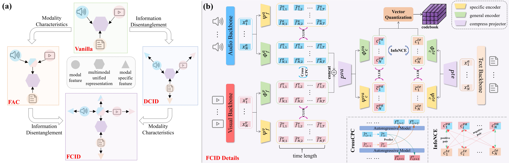

# Enhancing Multimodal Unified Representations for Cross Modal Generalization, ACL 2025 (Findings)

This is the Pytorch implementation of our paper:

Enhancing Multimodal Unified Representations for Cross Modal Generalization

------

### 📝Details
Please refer to [CMG](https://github.com/haihuangcode/CMG/blob/master/README.md)

### ✏Model Checkpoints And Date Feature
Google Driver or Huggingface 

[Google Driver](https://drive.google.com/drive/folders/1DOEen_1xNwWrgpd6-lTuepuF91tUGiBV)

[Huggingface](https://huggingface.co/datasets/haihuangcode/CMG/tree/main/CMG)

#### Checkpoint is FCID.pt
