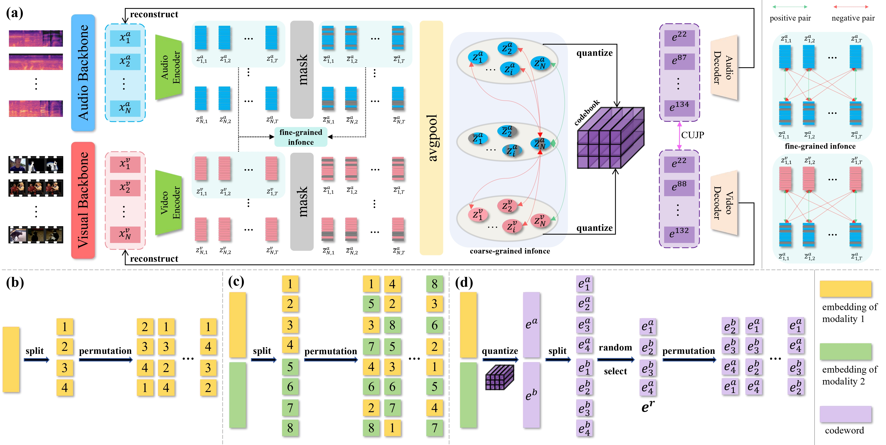

# Open-set Cross Modal Generalization via Multimodal Unified Representation, ICCV 2025

This is the Pytorch implementation of our paper:

Open-set Cross Modal Generalization via Multimodal Unified Representation

------

### 📝Details
Please refer to [CMG](https://github.com/haihuangcode/CMG/blob/master/README.md)

### ✏Model Checkpoints And Date Feature
[data](https://drive.google.com/drive/folders/1ThGAXoqay7RanGwHz21qZGMEjF3W1VwS)

Checkpoint is MICU.pt
